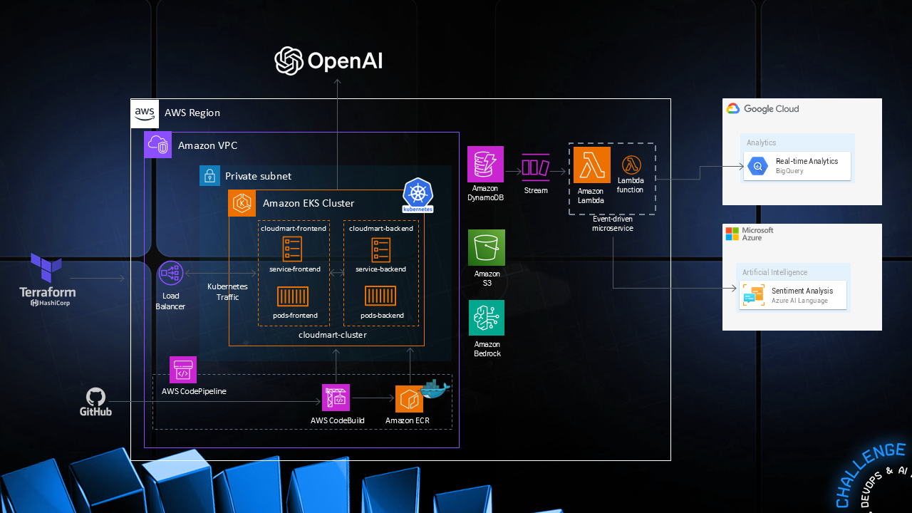

# 🌍 CloudMart: MultiCloud, DevOps & AI Challenge 🚀

## 📌 Overview

CloudMart is a **MultiCloud AI-driven architecture** integrating **AWS, Google Cloud, and Microsoft Azure** for a seamless, event-driven microservices ecosystem. This project leverages **Terraform, Kubernetes, OpenAI, and DevOps best practices** to deploy and orchestrate cloud-native applications at scale.

## 🔥 Key Features

- **🛠️ MultiCloud Integration**: Utilizes AWS, Google Cloud, and Microsoft Azure services.
- **🔄 Event-Driven Microservices**: Uses AWS Lambda and DynamoDB for real-time data streaming.
- **🛠️ DevOps Pipeline**: Built with Terraform, AWS CodePipeline, and AWS CodeBuild.
- **📊 Analytics**: BigQuery integration for real-time insights.
- **🧠 AI-Powered**: Azure AI Language for sentiment analysis & OpenAI for intelligent automation.
- **🚀 Containerized Deployment**: Kubernetes on Amazon EKS with fully managed clusters.

---

## 📂 Architecture Breakdown

### 🏗️ **Infrastructure as Code (IaC)**

- **Terraform** provisions AWS infrastructure, including:
  - Amazon VPC
  - Amazon EKS cluster
  - AWS CodePipeline & CodeBuild
  - Amazon DynamoDB
  - Amazon S3 & ECR

### 🎛️ **Amazon EKS Cluster**

- **Frontend Service** (`cloudmart-frontend`)
- **Backend Service** (`cloudmart-backend`)
- **Pods & Services** for scaling microservices
- **Kubernetes Load Balancer** for traffic management

### 🔗 **Event-Driven Architecture**

- **Amazon DynamoDB Streams** trigger AWS Lambda functions
- **Lambda Functions** process events and send data to BigQuery

### 📊 **Analytics & AI Components**

- **Google BigQuery** for real-time analytics
- **Microsoft Azure AI Language** for sentiment analysis
- **Amazon Bedrock + OpenAI** for AI-driven chatbot automation

---
